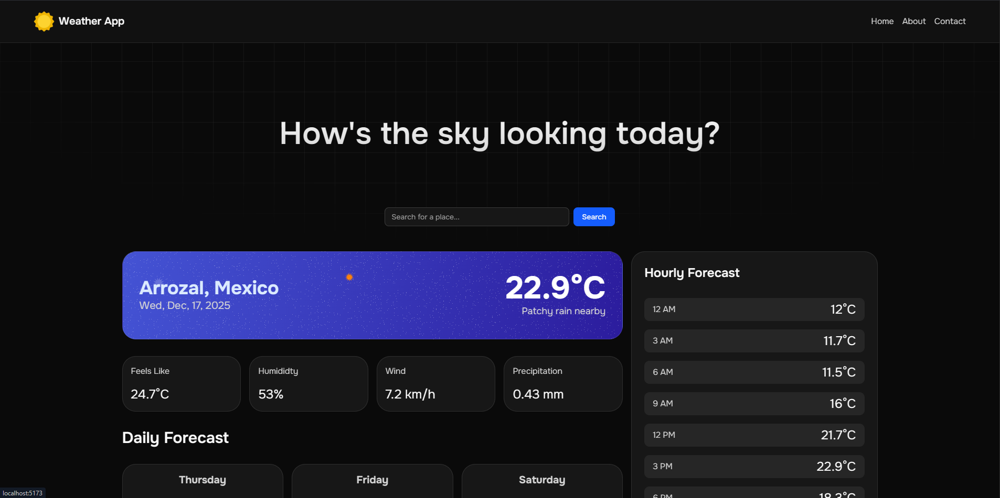

# Weather app solution

This is a solution to the [Weather app challenge on Frontend Mentor](https://www.frontendmentor.io/challenges/weather-app-K1FhddVm49). Frontend Mentor challenges help you improve your coding skills by building realistic projects.

## Table of contents

- [Overview](#overview)
  - [The challenge](#the-challenge)
  - [Screenshot](#screenshot)
  - [Links](#links)
- [My process](#my-process)
  - [Built with](#built-with)
  - [What I learned](#what-i-learned)
  - [Continued development](#continued-development)
  - [Useful resources](#useful-resources)
- [Author](#author)

## Overview

### The challenge

Users should be able to:

- Search for weather information by entering a location in the search bar
- View current weather conditions including temperature, weather icon, and location details
- See additional weather metrics like "feels like" temperature, humidity percentage, wind speed, and precipitation amounts
- Browse a 7-day weather forecast with daily high/low temperatures and weather icons
- View an hourly forecast showing temperature changes throughout the day
- Switch between different days of the week using the day selector in the hourly forecast section
- Toggle between Imperial and Metric measurement units via the units dropdown
- See hover and focus states for all interactive elements on the page

### Screenshot



### Links

- Solution URL: [Github](https://github.com/gabo2447/weather-app)
- Live Site URL: [Vercel](https://gl-weather.vercel.app)

## My process

### Built with

- Semantic HTML5 markup
- CSS custom properties
- Flexbox
- CSS Grid
- Mobile-first workflow
- [React](https://reactjs.org/) - JS library
- [Vite](https://vitejs.dev/) - Frontend Tooling
- [TypeScript](https://www.typescriptlang.org/) - For type safety
- [Tailwind CSS](https://tailwindcss.com/) - For styles
- [Zustand](https://zustand-demo.pmnd.rs/) - State Management
- [Radix UI](https://www.radix-ui.com/) - Unstyled, accessible components
- [Lucide React](https://lucide.dev/) - Icons

### What I learned

One significantly interesting part of this project was handling the mapping between the Third-Party API weather codes and our custom local assets.

```typescript
export const getWeatherIcon = (code: number): string => {
  const codeMap: Record<number, string> = {
    // Sunny / Clear
    1000: sunnyIcon,
    // Partly cloudy
    1003: partlyCloudyIcon,
    // ... maps remaining codes
  };
  return codeMap[code] || sunnyIcon;
};
```

This ensures that even if the API provides its own icons, we maintain a consistent and premium design language throughout the application.

### Continued development

In future iterations, I plan to:

- Implement a more robust error handling system for API failures.
- Add user preference persistence (saving the last searched city or unit preference).
- Improve accessibility features.

### Useful resources

- [Tailwind CSS Documentation](https://tailwindcss.com/docs) - Essential for rapid styling.
- [React Documentation](https://react.dev/) - Reference for Hooks and Components.

## Author

- Website - [Gabo2447](https://gl2447.vercel.app)
- Frontend Mentor - [@gabo2447](https://www.frontendmentor.io/profile/Gabo2447)
